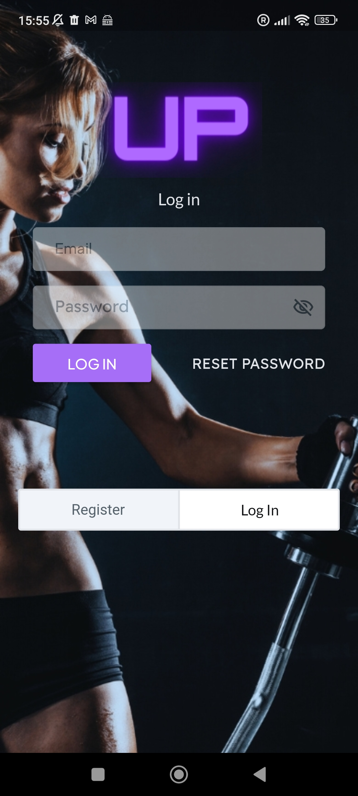
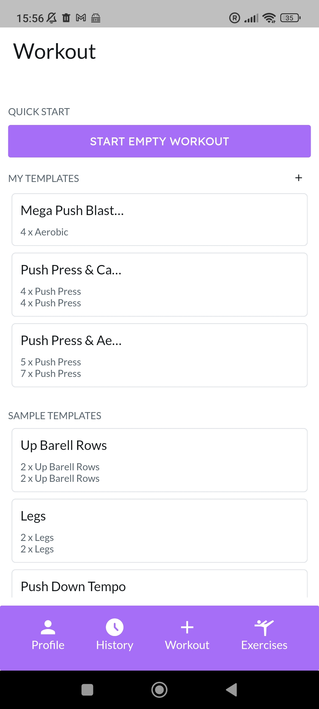
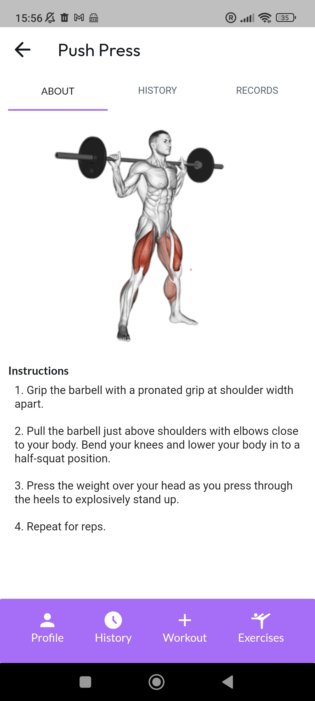

# UP - Workout Tracker

**UP** is a intuitive workout tracker & planner, built with Flutter for iOS and Android. It's crafted to enhance the effectiveness of your exercise routines and empower you to take control of your fitness journey.

## Features

- **Workout Tracking & Planning:** Easily build routines, track progress, and monitor gains with friends.
- **Stay Organized:** Plan your training schedules, set goals, and review your achievements.
- **Seamless Progress Monitoring:** Track every rep, set, and personal best with ease.
- **Simple & Powerful:** Designed to stay out of your way while offering the ultimate workout companion.

## Screenshots

## Installation

### Prerequisites

- Ensure your device allows installations from unknown sources.
- For Android devices, [enable unknown sources](https://www.androidcentral.com/unknown-sources) if necessary.

### Setup

1. **Download the APK**

    - Download the latest version of **UP** from the [Releases](./releases) section.

2. **Install the APK**

    - Locate the downloaded APK file on your device and tap to install.

3. **Launch the App**

    - Open **UP** from your app drawer and start tracking your workouts.